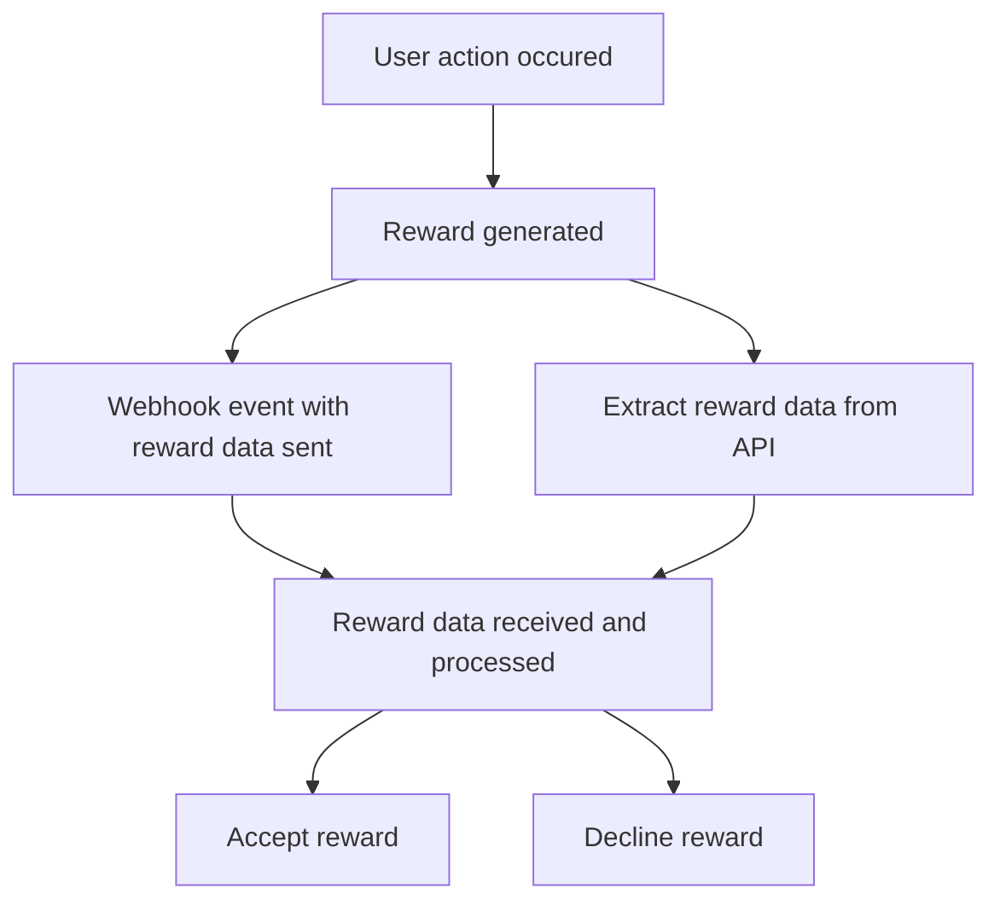

# Rewards

The Rewards API provides tools to manage and interact with game rewards efficiently.

## Lifecycle




## Key Features

### Listing Rewards
  - Use [RewardService#List](https://buf.build/toffeecard/toffee/docs/main:reward.v1#reward.v1.RewardService.List) to retrieve a list of rewards.
  - Supports filtering by [parameters](https://buf.build/toffeecard/toffee/docs/main:reward.v1#reward.v1.ListRequest) such as `game_id`, `user_id`, `timestamp`, etc.

  ```typescript
  const { rewards, cursor } = await rewardService.list({
    gameId: 'GAME',
    userId,
    from: Timestamp.fromDate(new Date('01-01-2024')),
    to: Timestamp.fromDate(new Date()),
    cursor: prevCursor,
    limit: 1000
  });
  ```

### Webhooks Integration
  - Reward data is automatically sent via [webhooks](/apis/webhooks), keeping your system updated in real time.

### After processing rewards on your side:
    * **Accept Rewards**: Notify us using [RewardService#Accept](https://buf.build/toffeecard/toffee/docs/main:reward.v1#reward.v1.RewardService.Accept) to confirm the reward has been applied.

    ```typescript
    await rewardService.accept({
      rewardId: reward.id
    });
    ```
    * **Decline Rewards**: Use [RewardService#Decline](https://buf.build/toffeecard/toffee/docs/main:reward.v1#reward.v1.RewardService.Decline) if the reward cannot be applied due to errors or other reasons.
      + Please discuss the issue with us to resolve any problems.

    ```typescript
    await rewardService.decline({
      rewardId: reward.id,
      reason: "Any reason"
    });
    ```
