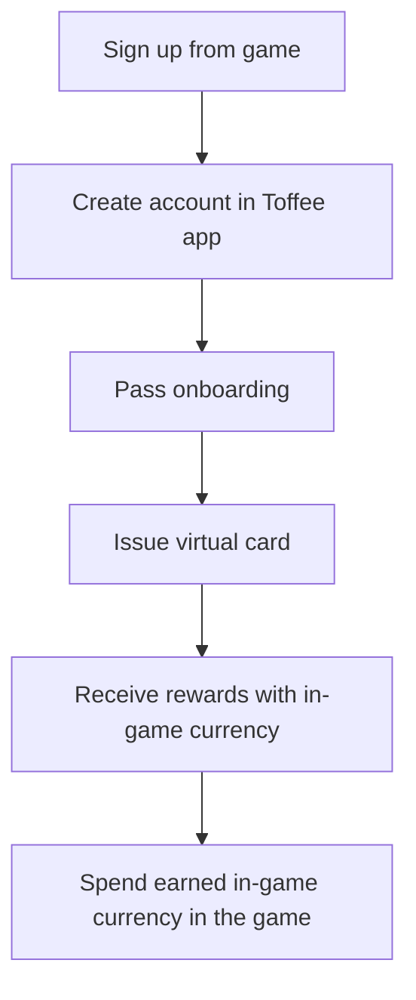

import config from '@generated/docusaurus.config';

# Introduction

This documentation describes the integration process with **{config.customFields.serviceName}** services.
**{config.customFields.serviceName}** enables gamers to issue payment cards, providing them with exclusive game bonuses and rewards for using these cards in their transactions.

## Process

The process begins with registering the game user in the system. After registration, you can access their activity data through webhooks, such as reward events from payment card usage, or retrieve necessary information via the API.

## Game user lifecycle

